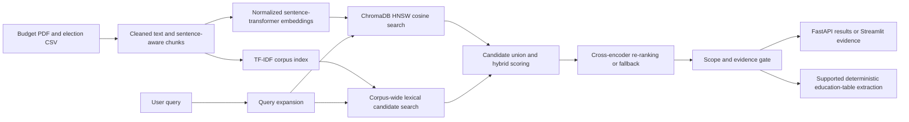

# Custom Framework-Agnostic RAG System with Cross-Encoder Re-Ranking

## Executive Summary

This repository implements a custom retrieval pipeline over Ghana's 2025 Budget Statement and election-result data. It combines sentence-aware corpus preparation, dense retrieval with ChromaDB, TF-IDF lexical retrieval, query expansion, and a PyTorch-backed cross-encoder reranker. FastAPI exposes a REST query endpoint, while Streamlit provides an interactive evidence-review interface.

The system deliberately avoids orchestration frameworks such as LangChain and LlamaIndex. This keeps chunk construction, candidate selection, score fusion, persistence, and runtime behavior visible and independently configurable. That control is useful for studying retrieval errors, memory use, and latency trade-offs; it does not by itself establish lower latency or better answer quality. Those properties require workload-specific benchmarks.

The current application is principally a retrieval-and-evidence system, not a general-purpose generative chatbot. It returns source passages and abstains when a question appears out of domain or retrieved evidence is weak. A deterministic extraction path answers the supported 2025 Ministry of Education allocation question. A general LLM answer-generation stage is not currently implemented.

## Key Features and Architectural Decisions

- **Sentence-aware preparation:** builds retrieval chunks from the election CSV and cleaned budget text, retaining complete election rows and avoiding arbitrary word-level cuts.
- **Query expansion:** adds domain-relevant variants for selected budget and election queries. Education budget questions receive a targeted Ministry of Education query.
- **Hybrid candidate generation:** combines dense vector candidates with corpus-wide TF-IDF candidates, so exact lexical matches can enter the pool even when vector search misses them.
- **Dense retrieval:** encodes queries and passages independently with `sentence-transformers/all-MiniLM-L6-v2`; normalized embeddings are searched in ChromaDB using cosine distance on its HNSW index.
- **Cross-encoder re-ranking:** scores query-passage pairs with `cross-encoder/ms-marco-MiniLM-L-6-v2` when available; a hybrid-score fallback is used if the model cannot load. The specialized education-summary path prioritizes its table row using hybrid retrieval scores.
- **Evidence gate:** limits supported responses to the indexed Ghana budget and election domain and rejects weak or invalid similarity scores. This is a conservative heuristic, not a proof that a passage entails an answer.
- **REST and interactive interfaces:** FastAPI returns support status and retrieved passages; Streamlit displays evidence and the supported education-allocation extraction.
- **Containerized local deployment:** Docker Compose runs the API and UI as separate services. The image downloads Python dependencies during build and Hugging Face models on first startup unless their cache is already populated.

## Architecture

### Implemented Request Path



### Generation Boundary

A general augmented-prompt-to-LLM generation stage is a planned extension, not part of the current runtime. The application must not be described as generating general natural-language answers until a generator, prompt policy, citations, and generation evaluations are implemented.

## Retrieval Method

### Bi-Encoder Recall and Cross-Encoder Precision

The bi-encoder embeds a query and each document independently:

\[
\mathbf{q} = f_q(q), \qquad \mathbf{d}_i = f_d(d_i)
\]

Because the embedding vectors are L2-normalized, dense similarity is computed as cosine similarity:

\[
s_{\text{cos}}(q,d_i) = \mathbf{q}^{\mathsf{T}}\mathbf{d}_i
\]

The independent document embeddings can be indexed once, allowing approximate nearest-neighbor search over the corpus. This favors retrieval throughput and recall, but a nearest neighbor can be topically related without answering the question.

A cross-encoder instead jointly processes each query-document pair:

\[
s_{\text{cross}}(q,d_i) = g([q; d_i])
\]

Joint attention can improve fine-grained relevance ordering, at the cost of running inference for each candidate pair. In this implementation, cross-encoder outputs are used for ranking, not as calibrated probabilities of factual support. The evidence gate uses the hybrid retrieval signals and scope heuristics.

### Approximate Nearest Neighbors

ChromaDB's HNSW index provides approximate nearest-neighbor search. HNSW is the search/indexing method; cosine similarity is the embedding comparison metric. They are complementary parts of the dense retrieval stage, not competing similarity measures.

## Technical Stack

| Area | Technologies | Role |
|---|---|---|
| Machine learning and NLP | PyTorch, Hugging Face Transformers, Sentence Transformers, scikit-learn | Dense embeddings, cross-encoder inference, and TF-IDF lexical scoring |
| Vector database | ChromaDB with HNSW and cosine distance | Approximate nearest-neighbor retrieval over normalized embeddings |
| Backend/API | FastAPI, Uvicorn, Pydantic | REST health and query endpoints |
| User interface | Streamlit | Interactive query and retrieved-evidence review |
| Data preparation | Python, CSV/JSON, sentence-aware chunking | Prepare budget text and election records for indexing |
| Deployment | Docker, Docker Compose | Containerized API and UI services |

## Repository Layout

```text
RAG-System/
├── app.py                         # Streamlit interface
├── api.py                         # FastAPI application and query endpoint
├── modules/
│   ├── answering.py               # Conservative education-table answer extraction
│   ├── chunker.py                 # Sentence-aware corpus preparation
│   ├── embedding.py               # Sentence Transformer embedding wrapper
│   ├── evidence.py                # Scope and evidence sufficiency heuristics
│   ├── keyword_search.py          # TF-IDF retrieval
│   ├── models.py                  # Retrieved-document schema
│   ├── query_expansion.py         # Domain-specific expansion
│   ├── reranker.py                # Cross-encoder and fallback ranking
│   ├── retrieval_engine.py        # Hybrid retrieval orchestration
│   └── vector_store.py            # ChromaDB wrapper
├── 2025-Budget-Statement-and-Economic-Policy_v4.pdf
├── Ghana_Election_Result.csv
├── cleaned_budget_text.txt
├── processed_chunks.json
├── Dockerfile
├── docker-compose.yml
├── .gitignore
├── .dockerignore
└── requirements.txt
```

## Local Installation

### Prerequisites

- Python 3.11 or 3.12
- Git
- Internet access for dependency installation and first-time Hugging Face model downloads

Clone the repository. Replace the placeholder URL with the URL of the published repository:

```bash
git clone https://github.com/<your-account>/<your-repository>.git
cd RAG-System
```

Create and activate a virtual environment.

**Windows PowerShell:**

```powershell
py -3.12 -m venv .venv
.\.venv\Scripts\Activate.ps1
python -m pip install --upgrade pip
python -m pip install -r requirements.txt
```

**macOS or Linux:**

```bash
python3.12 -m venv .venv
source .venv/bin/activate
python -m pip install --upgrade pip
python -m pip install -r requirements.txt
```

The project does not currently read a `.env` file and does not require API keys. Model identifiers are configured in the Python modules. Hugging Face's standard `HF_HOME` environment variable may be set to choose a model-cache directory; it is optional and is not a project-specific setting.

Run the API and UI in separate terminals from the repository root.

**Terminal 1 - FastAPI:**

```bash
python -m uvicorn api:app --reload --host 127.0.0.1 --port 8000
```

The API is available at `http://127.0.0.1:8000`; interactive OpenAPI documentation is at `http://127.0.0.1:8000/docs`.

**Terminal 2 - Streamlit:**

```bash
python -m streamlit run app.py --server.port 8501
```

The UI is available at `http://localhost:8501`.

Example API request:

```bash
curl -X POST http://127.0.0.1:8000/query \
  -H "Content-Type: application/json" \
  -d '{"query":"What was allocated to education in the 2025 budget?","k":5}'
```

The API returns retrieved passages and a `supported` flag; the UI can extract the supported Ministry of Education 2025 total. Neither interface currently provides general LLM-generated answers.

## Docker Deployment

Docker and the Docker Compose plugin are required. From the repository root:

```bash
docker compose up --build
```

- Streamlit: `http://localhost:8501`
- FastAPI: `http://localhost:8000`
- FastAPI OpenAPI docs: `http://localhost:8000/docs`

Stop the services with `Ctrl+C`, or run `docker compose down` from another terminal. The first image build installs Python dependencies; the first service startup may download the embedding and cross-encoder models. This is a host-Python-independent deployment, not an offline or network-free install.

## Evaluation Status

No reproducible benchmark results or held-out evaluation set are currently committed to this repository. Therefore, Recall@10, Precision@3, and hallucination reduction must be treated as **not measured**, not as established system performance. An approximately 42% hallucination-reduction figure has been suggested as a target/claim, but this repository does not contain the experiment needed to substantiate it.

| Measure | Naive bi-encoder baseline | Hybrid retrieval with re-ranking | Evidence status |
|---|---:|---:|---|
| Recall@10 | Not measured | Not measured | Requires labeled relevant passages and a fixed query set |
| Precision@3 | Not measured | Not measured | Requires relevance judgments at rank 3 |
| Hallucination-rate reduction | Baseline not measured | Approximately 42% is an unverified target, not a result | Requires answer-level factuality annotations and a documented protocol |

A defensible comparison should freeze the corpus and query set, report query-level metrics with the same relevance labels, specify the retrieval configuration and model versions, and include confidence intervals or per-query results. Hallucination reduction should be measured on generated answers against cited source evidence; because general answer generation is not implemented, that measure is not currently available.

## Limitations and Responsible Interpretation

- Retrieval relevance is not equivalent to factual entailment. Inspect source passages before relying on a result.
- The evidence/scope gate is heuristic and can reject valid questions or accept weakly related passages; it is not a calibrated confidence estimator.
- General-purpose natural-language generation is not currently wired into the application. Only a narrow, deterministic education-allocation answer extractor is implemented.
- The API indexes the corpus during application startup. Streamlit also constructs its own retrieval engine, so running both services duplicates model loading and indexing work.
- Cross-encoder availability depends on successfully loading the Hugging Face model. The reranker falls back to hybrid-score ordering if initialization fails.
- First startup requires access to Hugging Face model artifacts unless they are already cached.
